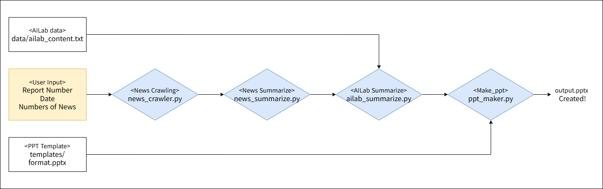

# Weekly Report AI Agent

## 🗝️ Key Features
- Automates web news crawling
- Automatically summarizes news articles and AI Lab news
- Generates PowerPoint (PPTX) slides with customized styling





## ⚙️ Installation

1. Clone the repository
```bash
   git clone https://github.com/esthyj/ai-weekly-report.git
   cd ai-weekly-report
```

2. Set up a virtual environment and install dependencies
```bash
   # Create and activate a virtual environment
   python -m venv venv
   source venv/bin/activate          # Windows: venv\Scripts\activate

   # Install dependencies
   pip install -r requirements.txt

   # If you see "lxml.html.clean ImportError" (newspaper3k + lxml>=5 compat issue):
   pip install lxml_html_clean
```

3. Set up environment variables
```bash
   # Create .env file
   ANTHROPIC_API_KEY=your_api_key_here
```

## 🚀 Usage

1. Add ailab content to `ailab_content.txt`

2. Run the script
```bash
   python main.py
```

3. Follow the prompts
```
   리포트 발행 호수를 입력하세요 (예: 25): 26
   리포트 발행 날짜를 입력하세요 (예: 2025년 12월 26일): 2025년 12월 30일
   선택할 뉴스 개수를 입력하세요 (기본값: 4): 3
   선택할 기사 번호를 입력하세요 (공백으로 구분, 예: 5 6 3 15): 7 2 10 8
   1개 이상의 포함할 요약 번호를 띄어쓰기로 구분하여 입력하세요. (예: 1 3 5): 2 1
```

4. `output.pptx` will be generated

## 🌐 Web Demo (FastAPI)

브라우저에서 파이프라인을 단계별로 체험할 수 있습니다 (로컬 전용).

```bash
uvicorn app:app --reload --port 8000
# → http://localhost:8000
```

- 호수/날짜 입력 → 실제 크롤링 진행상황을 SSE 로그로 실시간 표시 → 기사 체크 → AI 요약 → 검토 (수락/다시 요약/다시 선택) → PPT 다운로드.
- 서버는 운영자의 `ANTHROPIC_API_KEY`를 사용합니다 (없으면 503).
- 세션은 in-memory dict로 30분간 유지됩니다.

## 📁 File Structure

```
ai-weekly-report/
├── data/
│   ├── ailab_content.txt      # AI Lab content input file
│   └── diagram_new.png        # Workflow diagram image
├── notebooks/
│   └── check_env.ipynb        # Environment checks
├── output/                    # Generated output files
│   └── *.pptx                 # Generated PowerPoint reports
├── src/
│   ├── __init__.py
│   ├── ailab_summarize.py     # AI Lab content summarizer
│   ├── config.py              # Project paths + directory checks
│   ├── llm_client.py          # Shared Anthropic client + call_llm helper
│   ├── news_crawler.py        # Web news crawler
│   ├── news_summarize.py      # News article summarizer
│   └── ppt_maker.py           # PowerPoint generator
├── templates/
│   └── AIWeeklyReport_format.pptx  # PowerPoint template
├── .env                       # Environment variables (API keys)
├── .gitignore
├── main.py                    # Run main.py
├── requirements.txt           # Python dependencies
└── README.md
```

## ⚠️ Limitations!

- **News Volume**: If there is a limited volume of new news content, the generated report may not achieve a high level of quality.
- **Past Events**: Even if the content itself refers to past events, it may still be extracted if the news article was published recently.


